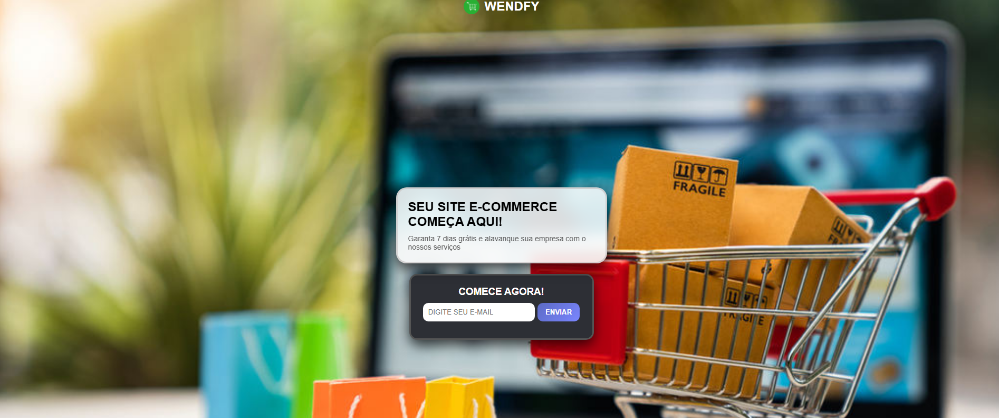

# 🛒 Landing Page E-commerce

## 🚀 Projeto online 
👉 [Acessar projeto] (https://wendsoncardoso.github.io/landing-page-ecommerce/)

Landing page de e-commerce moderna e responsiva, focada em performance, usabilidade e experiência do usuário.

---

## 🔥 Demonstração  
👉 [Acessar projeto online](https://wendsoncardoso.github.io/landing-page-ecommerce/)

---

## 📸 Preview



---

## 🚀 Tecnologias utilizadas

- HTML5  
- CSS3  
- JavaScript  
- Responsividade (Mobile First)  

---

## 🎯 Funcionalidades

- Formulário com validação  
- Animações modernas  
- Design responsivo  
- Interface estilo e-commerce  

---

## 📂 Estrutura do projeto

```bash
├── index.html        # Página principal
├── css               # Estilos
├── js                # Scripts
├── imagens           # Imagens do projeto
```

---

## 📌 Autor  

Desenvolvido por Wendson
